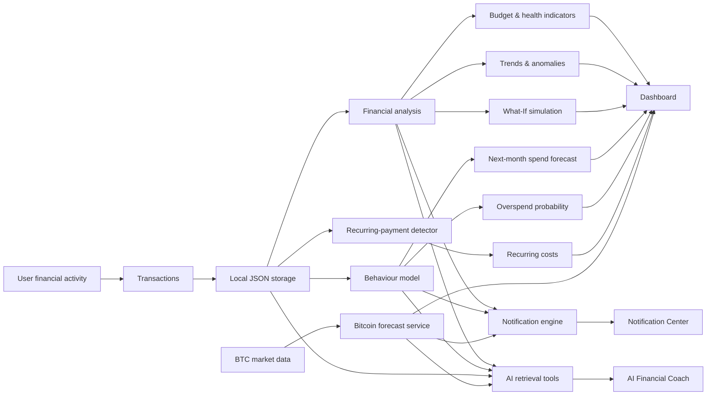
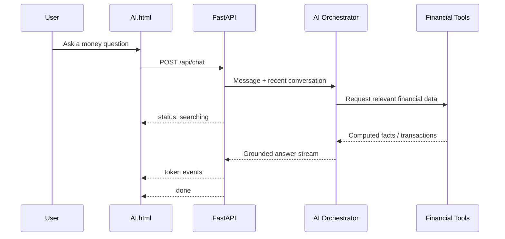

<div align="center">

# Fiscora

### A bilingual finance cockpit that turns transaction history into forecasts, risk signals, and grounded answers.

Fiscora is a personal-finance intelligence application for users in Iran and the United States. It connects transaction tracking, spending analysis, next-month behaviour forecasting, recurring-payment detection, receipt OCR, proactive alerts, a context-aware AI coach, and an experimental Bitcoin forecasting console inside one locally served application.

**Built as an Innoverse competition project.**

</div>

---

## Overview

Most finance dashboards can answer a historical question:

> **Where did my money go?**

Fiscora is designed to go further:

> **What does my recent financial behaviour mean, what may happen next, and what can I do about it?**

The application combines deterministic financial analysis with two separate machine-learning systems:

- a **financial-behaviour model** that estimates next-month spending growth and overspend probability;
- a **Bitcoin forecasting model** that produces a direct 10-day return forecast with an uncertainty estimate and an UP / DOWN / HOLD signal.

Those outputs are then connected to the rest of the product: dashboard analytics, savings opportunities, recurring-payment detection, alerts, simulations, and an AI assistant that retrieves facts from the user's own financial data instead of answering from generic context.

The core idea is simple:

**transaction data → financial context → forecasting → insight → action**

---

## Table of Contents

- [The Problem](#the-problem)
- [What Fiscora Does](#what-fiscora-does)
- [How the Product Flows](#how-the-product-flows)
- [System Architecture](#system-architecture)
- [Financial Intelligence Engine](#financial-intelligence-engine)
- [Financial Behaviour Forecasting](#financial-behaviour-forecasting)
- [Bitcoin Forecasting](#bitcoin-forecasting)
- [AI Financial Coach](#ai-financial-coach)
- [Receipt OCR](#receipt-ocr)
- [Notification Engine](#notification-engine)
- [Localization and Personalization](#localization-and-personalization)
- [Technology Stack](#technology-stack)
- [API Surface](#api-surface)
- [Repository Structure](#repository-structure)
- [Running Locally](#running-locally)
- [Verification](#verification)
- [Privacy and Security](#privacy-and-security)
- [Current Limitations](#current-limitations)
- [Future Engineering Work](#future-engineering-work)
- [Financial Disclaimer](#financial-disclaimer)

---

## The Problem

A transaction list is useful, but it does not automatically tell someone:

- whether their spending pace is sustainable;
- whether a category is drifting upward;
- whether a large purchase is unusual for them;
- whether their current balance can support their recent burn rate;
- which repeated payments are quietly becoming fixed monthly costs;
- how changing one category could affect the rest of the month;
- or whether a forecast is actually better than a simple baseline.

Generic AI assistants have another limitation: unless the relevant financial facts are retrieved and supplied explicitly, they do not know the user's real budget, transactions, category totals, forecasts, or account state.

Fiscora addresses these problems by placing analysis, forecasting, retrieval, and interaction behind the same financial data model.

---

## What Fiscora Does

### Financial awareness

Fiscora maintains a user-specific financial state containing transactions, current balance, monthly budget, category spending, historical summaries, and preferences.

The dashboard derives and displays:

- current balance;
- month-to-date spending;
- projected month-end expenditure;
- budget-overrun probability;
- spending by category;
- recent daily spending;
- financial-health score;
- category-level changes;
- recent transactions;
- savings opportunities;
- recurring payments;
- behavioural forecasts.

Transactions can be entered manually or created from reviewed receipt OCR results.

### Predictive intelligence

Fiscora contains three different forecasting mechanisms, deliberately kept separate:

1. **Month-end projection**  
   A deterministic statistical projection based on recent spending patterns and weekday behaviour.

2. **Next-month financial behaviour model**  
   An LSTM-based multi-task model that predicts spending growth and probability of exceeding the budget.

3. **Bitcoin 10-day model**  
   A direct multi-horizon Conv1D/LSTM model trained to predict the next ten daily log-returns.

These components solve different problems and do not share a single vague "AI engine."

### Actionable analysis

The application converts the financial history into additional decision-support features:

- category trend detection;
- unusual-spending detection;
- large-transaction detection;
- estimated savings opportunities;
- recurring-payment discovery;
- balance runway;
- budget risk;
- configurable What-If simulations;
- proactive notifications.

### Context-aware AI

The AI coach can retrieve computed financial facts and transaction data through a controlled set of backend tools.

This allows questions such as:

- How much did I spend recently?
- Which category is taking the largest share?
- Which transactions match a merchant or category?
- How is my spending tracking against my budget?
- What unusual spending has been detected?
- What is the current Bitcoin model outlook?

Financial arithmetic is performed in the Python backend. The language model is used to select retrieval tools and explain the resulting data.

---

## How the Product Flows



---

## System Architecture

Fiscora is intentionally compact: the browser frontend and machine-learning notebooks are connected through one FastAPI application server.

```mermaid
flowchart TB
    subgraph Browser["Browser"]
        Dashboard["Dashboard · index.html"]
        BitcoinUI["Bitcoin Console · bitcoin.html"]
        ChatUI["AI Coach · AI.html"]
        Notifications["Notifications · notification.html"]
        Theme["Shared design system · style.css"]
    end

    subgraph Backend["FastAPI · server.ipynb"]
        Auth["Accounts & sessions"]
        Tx["Transaction service"]
        Analytics["Financial analysis"]
        Advisor["Budget advisor & What-If"]
        Recurring["Recurring-payment detector"]
        OCR["Receipt OCR"]
        FinanceService["Financial-behaviour model service"]
        BTCService["Bitcoin service"]
        LLM["Grounded LLM orchestrator"]
        AlertEngine["Notification engine"]
        Scheduler["Background scheduler"]
    end

    subgraph Storage["Local project storage"]
        Users["User profiles & sessions"]
        TxJSON["Per-day transaction JSON"]
        Summaries["Daily summaries"]
        Alerts["Notification JSON"]
        Receipts["Receipt images"]
        FinanceArtifacts["Finance model artifacts"]
        BTCArtifacts["Bitcoin model artifacts"]
    end

    subgraph External["Optional external services"]
        GapGPT["OpenAI-compatible GapGPT endpoint"]
        CryptoCompare["CryptoCompare"]
        CoinGecko["CoinGecko"]
    end

    Dashboard --> Backend
    BitcoinUI --> Backend
    ChatUI --> Backend
    Notifications --> Backend

    Auth --> Users
    Tx --> TxJSON
    Tx --> Summaries
    OCR --> Receipts

    TxJSON --> Analytics
    TxJSON --> Advisor
    TxJSON --> Recurring
    TxJSON --> FinanceService

    FinanceArtifacts --> FinanceService
    BTCArtifacts --> BTCService

    BTCService --> CryptoCompare
    BTCService --> CoinGecko

    Analytics --> LLM
    Advisor --> LLM
    BTCService --> LLM
    LLM --> GapGPT
    OCR -. structured extraction when configured .-> GapGPT

    Analytics --> AlertEngine
    Advisor --> AlertEngine
    BTCService --> AlertEngine
    AlertEngine --> Alerts

    Scheduler --> AlertEngine
    Scheduler --> Summaries
    Scheduler --> BTCService
```



---

# Financial Intelligence Engine

Not every intelligent-looking feature in Fiscora is machine learning. Several important decisions are made by explicit, inspectable algorithms.

That distinction matters: deterministic financial logic is easier to audit and does not need a neural network merely to appear sophisticated.

## Month-end projection

The budget engine builds a 28-day spending history and estimates the remainder of the current month using recent weekday-specific spending behaviour.

It also performs **300 bootstrap simulations** over recent daily totals to produce:

- projected month-end spending;
- a P20–P80 projection band;
- probability of exceeding the configured monthly budget;
- current daily burn rate.

The result is used by both the dashboard and the notification system.

## Financial Health Score

The application generates a 0–100 financial-health score from four components:

| Component | Weight |
|---|---:|
| Budget discipline | 35% |
| Savings rate | 25% |
| Spending stability | 20% |
| Category balance | 20% |

The score is therefore derived from explicit financial behaviour rather than an opaque LLM judgment.

## Spending anomalies

Fiscora analyzes historical behaviour for two notable patterns:

**Category spikes** compare recent weekly category spending with previous weeks and flag sufficiently unusual increases.

**Large transactions** compare recent purchases against the user's historical transaction-size distribution rather than using one universal monetary threshold.

This makes the alerting logic relative to the user's own spending scale.

## Recurring-payment detection

Recurring-payment discovery is deterministic.

The detector examines up to 120 days of history, groups similar merchant/amount patterns, and requires at least three observations before identifying a recurring cadence.

It recognizes approximately:

- **weekly** intervals: 6–8 days;
- **monthly** intervals: 25–35 days.

Detected entries include an estimated recurring amount, normalized monthly cost, cadence, and approximate next expected charge.

This is intentionally different from claiming that a machine-learning model identifies subscriptions.

## Savings opportunities

Fiscora compares recent category spending with earlier behaviour and looks for elevated discretionary categories.

When an eligible category has meaningfully increased, the application estimates how much expenditure could potentially be reduced and surfaces the result as a savings opportunity.

These are **scenario estimates**, not guaranteed savings.

## What-If simulator

The What-If engine lets the user change category spending assumptions and recomputes the projected financial outcome.

For example, reducing Food & Dining by a chosen percentage affects:

- projected remaining expenditure;
- projected month-end spending;
- estimated monthly saving;
- budget position.

The simulator operates on the actual category-level spending state rather than changing a decorative number in the frontend.

---

# Financial Behaviour Forecasting

`Financa.ipynb` trains a separate sequence model for the user's broader financial behaviour.

Its two targets concern the **next month**:

1. **Spending growth**  
   Regression on:

   `log(next_month_spend / current_month_spend)`

2. **Overspend probability**  
   Classification of:

   `P(next_month_spend > budget)`

Because the regression target is a growth factor rather than an absolute currency amount, the same model architecture can be applied to both USD and Toman users.

## Input representation

The training data contains **900 users × 30 months = 27,000 user-month records**.

Each month is converted into 22 scale-independent features:

- spend-to-income ratio;
- budget utilization;
- savings rate;
- month-over-month spending growth;
- weekend spending ratio;
- largest-transaction share;
- log transaction count;
- crypto intensity;
- crypto transaction activity;
- cyclical month encoding;
- 11 category spending shares.

The model receives a **6-month sequence** and predicts the following month.

Users are split between training and validation sets, preventing the same user identity from appearing on both sides of the split.

## Model

```text
6 months × 22 features
        │
        ▼
     LSTM(64)
        │
     Dropout
        │
     LSTM(32)
        │
     Dropout
        │
 Dense(32, Swish)
      /       \
     /         \
Spend growth   Overspend
 regression    probability
   head          head
```

The regression head uses Huber loss. The classification head uses binary cross-entropy.

## Recorded validation results

The notebook's executed validation run reports:

| Metric | Model | Baseline |
|---|---:|---:|
| Log-growth MAE | **0.1887** | 0.2571 no-change |
| Reconstructed spend-ratio MAE | **0.2014** | 0.2728 no-change |
| Overspend accuracy | **71.41%** | 65.79% majority class |
| Overspend ROC AUC | **0.7595** | — |

These numbers come from the included training notebook, not from a production population.

The behaviour dataset is explicitly described by the model metadata as a **synthetic-but-coherent behaviour panel**. The metrics demonstrate that the pipeline is functioning and can outperform the included simple baselines on that dataset; they are not evidence of equivalent accuracy on real personal-finance data.

## Serving path

The training notebook writes model artifacts under:

```text
data/finance/
├── finance_model.keras
├── finance_model.weights.h5
├── finance_scaler.pkl
└── finance_meta.json
```

`server.ipynb` loads these artifacts and reconstructs the same feature order from the user's stored transaction history.

The `/api/behavior` response contains:

- predicted next-month spending;
- current spending;
- predicted growth percentage;
- overspend probability;
- low / medium / high risk classification;
- dominant category;
- grounded behavioural tips;
- stored model metrics.

If the model artifacts are unavailable, the dashboard hides this forecast rather than replacing it with a fabricated result.

---

# Bitcoin Forecasting

Fiscora's Bitcoin module is an **experimental forecasting and model-transparency system**, not an automated trading system.

It combines:

1. historical BTC data used by the training notebook;
2. engineered return-space features;
3. a direct 10-day neural forecast;
4. uncertainty estimation;
5. simple forecasting baselines;
6. a live/fallback market-data service;
7. an informational UP / DOWN / HOLD signal.

## Training pipeline

`bitcoin.ipynb` implements the complete model pipeline.

### Data

The notebook expects:

```text
datasets/btc/btc.csv
datasets/btc/btc_test.csv
```

The historical training file ends in June 2024.

The supplied test series continues through 2029 and is explicitly treated by the notebook as a **synthetic future series**. Metrics from that future-dated portion therefore evaluate behaviour on a simulated regime, not actual future Bitcoin prices.

### Features

The network receives **60 days of context** represented by 20 causal features.

Raw Bitcoin price is deliberately excluded from the neural-network inputs.

The feature set includes:

- log returns;
- intraday range and close position;
- volume dynamics;
- 7/14/30-day realized volatility;
- RSI;
- MACD, signal and histogram;
- Bollinger %B;
- price-to-SMA ratios;
- 7/14-day rate of change;
- day-of-week sine/cosine encoding.

### Target

Instead of recursively predicting one price and feeding it back into the next step, the network directly predicts:

```text
[r(t+1), r(t+2), ... r(t+10)]
```

where each value is a next-day log-return.

This creates a direct 10-day output vector and avoids recursive forecast accumulation inside the neural network.

### Model architecture

```text
60 days × 20 features
          │
          ▼
 Conv1D · 48 filters
     causal / Swish
          │
          ▼
       LSTM(96)
          │
       Dropout
          │
       LSTM(48)
          │
       Dropout
          │
   Dense(48, Swish)
          │
          ▼
 Dense(10, Linear)
          │
          ▼
10 future daily log-returns
```

Training uses:

- Huber loss;
- AdamW when available;
- gradient clipping;
- early stopping;
- learning-rate reduction;
- best-model checkpointing.

The notebook saves:

```text
data/btc/
├── model.keras
├── scalers.pkl
└── metadata.json
```

## Walk-forward evaluation

The notebook evaluates every forecast chronologically using information that was available at each forecast anchor.

It also compares the model with:

- **persistence** — future price remains flat;
- **60-day drift** — recent mean daily drift continues;
- **always-up** — directional base rate.

This comparison is intentionally exposed because a neural forecast is not useful merely because it contains an LSTM.

### Final synthetic test

On the future-dated synthetic final-test portion, the recorded metrics are:

| Strategy | MAPE +1 day ↓ | MAPE +10 days ↓ | Direction +1 day ↑ | Direction +10 days ↑ |
|---|---:|---:|---:|---:|
| LSTM | 2.03% | 6.95% | 48.79% | 50.31% |
| Persistence | **2.01%** | **6.67%** | — | — |
| 60-day drift | 2.03% | 7.28% | **51.41%** | **53.41%** |
| Always-up base rate | 2.01% | 6.67% | 49.62% | 50.79% |

The important result is not a marketing-friendly one: **this final synthetic test does not establish a material forecasting edge over the naive baselines.**

Fiscora keeps that result visible rather than hiding it.

The Bitcoin interface is therefore designed around uncertainty and model inspection, not a claim of reliable market prediction.

## Runtime market-data chain

The server does not depend on the training CSV for normal live data when network sources are available.

It attempts the following sequence:

1. **CryptoCompare `histoday`**  
   Daily BTC/USD OHLCV data.

2. **CoinGecko `market_chart`**  
   Daily price and volume. Because this endpoint does not provide equivalent OHLC data, Open/High/Low values are approximated from adjacent closes.

3. **Cached successful response**

4. **Dataset fallback**  
   Used only when network sources and usable cache data are unavailable.

The frontend always receives the data-source label so it can distinguish live, approximated, cached, and offline data.

## Signal semantics

The 10-day model output is converted into an:

- `UP`
- `DOWN`
- `HOLD`

view using thresholds stored with the model metadata.

The displayed **confidence value is a normalized measure of predicted move strength relative to that threshold**. It should not be interpreted as a calibrated probability that the forecast will be correct.

The interface also shows estimated uncertainty and the recorded model evaluation data.

---

# AI Financial Coach

The AI assistant is designed as a retrieval-driven interface over the financial system rather than a chatbot that receives an enormous undifferentiated prompt.

## Tool access

The backend exposes six tools to the assistant:

| Tool | Purpose |
|---|---|
| `get_spending_summary` | Aggregate spending and category totals |
| `search_transactions` | Search transactions by query, category and dates |
| `get_daily_files` | Retrieve raw daily transaction records for up to the last 30 days |
| `get_budget_status` | Retrieve balance, projection, budget risk and runway |
| `get_insights` | Retrieve computed trends, anomalies and financial insights |
| `get_btc_context` | Retrieve Bitcoin market context and the model signal |

The language model is explicitly instructed not to invent monetary values.

When a financial number is required, it must come from a tool result.

The Python backend remains responsible for calculations; the model is primarily responsible for retrieval decisions and natural-language explanation.

## Request flow



`AI.html` consumes NDJSON events and renders streamed response tokens.

Conversation history is kept in browser `sessionStorage`, while a bounded recent history is sent with subsequent questions.

## Resilience

The AI layer has explicit fallback behaviour.

If function/tool calling is unavailable, the server can prefetch a smaller grounded context before generating the response.

If the configured LLM service is unavailable entirely, Fiscora can still return a deterministic bilingual financial summary from the local analysis engine.

A missing AI provider therefore does not make the rest of the finance application unusable.

## LLM integration

The current backend uses the OpenAI Python SDK against an **OpenAI-compatible GapGPT endpoint**.

The configured chat model in the supplied server notebook is:

```text
gpt-5.4
```

This integration is optional. Core transaction storage, deterministic analysis, budgeting, simulations and non-LLM fallback paths remain separate from it.

---

# Receipt OCR

Fiscora supports Persian and English receipt capture.

The implemented flow is:

```text
Receipt image
    ↓
Image preprocessing
    ↓
EasyOCR · Persian + English
    ↓
Text normalization
    ↓
Optional LLM structured extraction
    ↓
Regex fallback if needed
    ↓
Editable review screen
    ↓
User confirmation
    ↓
Saved transaction
```

The OCR subsystem uses EasyOCR and Pillow, with optional OpenCV preprocessing when available.

For Iranian receipts, the backend also detects Rial-labelled amounts and can normalize them to the account's Toman base currency.

Extracted merchant names, line items, quantities, prices and totals are presented for review before they are written into transaction history.

The OCR result is therefore treated as a **draft**, not unquestioned ground truth.

---

# Speech-to-Text

The AI chat interface can record voice input through the browser's `MediaRecorder` API.

The audio flow is:

```text
Browser microphone
      ↓
MediaRecorder
      ↓
POST /api/stt
      ↓
whisper-1 transcription
      ↓
Text inserted into chat input
```

Persian and English language hints are supported.

The transcription is **inserted into the input field and is not automatically submitted**, giving the user a chance to review it first.

---

# Notification Engine

Fiscora's notification system separates **event detection** from **language generation**.

Python rules decide whether something happened. An LLM may phrase the resulting numerical facts in natural English and Persian; deterministic templates are used when the LLM is unavailable.

| Notification | Trigger | Cooldown |
|---|---|---|
| Budget risk | Overrun probability ≥ 60% after at least five days of the month | Once per month |
| Low balance | Estimated runway below seven days | Once per ISO week |
| Category spike | Weekly category z-score ≥ 2 | Once per category per month |
| Large transaction | Purchase > 1.5× the user's 90-day P95 transaction size | Once per transaction |
| Bitcoin signal | Model changes to UP or DOWN and BTC alerts are enabled | Once per signal per week |
| Weekly digest | User-local digest day | Once per week |

Weekly digests are localized to the account region:

- **Iran:** Friday
- **United States:** Sunday

Notifications are stored with:

- type;
- severity;
- English and Persian title/body;
- underlying facts;
- read state;
- cooldown key.

The notification page polls for new entries, supports unread filtering, individual details, and mark-as-read actions.

---

# Localization and Personalization

Fiscora has first-class support for two application profiles:

| Region | Language | Base accounting currency | Calendar / timezone |
|---|---|---|---|
| Iran | Persian | Toman | Jalali · Asia/Tehran |
| United States | English | USD | Gregorian · America/New_York |

## Persian and RTL

Persian is not implemented as a few translated labels on an English layout.

The UI switches:

- document language;
- text direction;
- typography;
- logical alignment;
- navigation flow;
- date presentation.

The shared CSS design system includes dedicated RTL handling and uses Vazirmatn for Persian typography.

## Toman and Rial

Iranian account values are stored internally in **Toman**.

The settings interface can display them as:

- Toman;
- Rial.

Rial display is a deterministic `Toman × 10` representation, not a foreign-exchange conversion.

## Theme system

Visual preferences are browser-persistent and include:

- multiple theme presets;
- custom primary colour;
- custom accent colour;
- five text-size levels;
- English / Persian switching.

The colour engine changes two core design tokens and derives the surrounding metal, glow and surface treatments from them.

---

# Visual Design

The interface uses an automotive cockpit direction rather than the conventional bright card-based style of many finance applications.

Its design language includes:

- forged-carbon-inspired surfaces;
- woven carbon patterns;
- smoked glass;
- thin metallic borders;
- chamfered panel geometry;
- satin-metal accents;
- compact instrumentation;
- high-contrast financial telemetry.

The source design system describes the original visual direction as MANSORY-inspired.

**Fiscora is an independent project and is not affiliated with, sponsored by, or endorsed by MANSORY.** The reference is strictly visual inspiration.

The frontend is built without a JavaScript UI framework. Charts and visualizations are rendered with the native Canvas 2D API.

---

# Technology Stack

| Layer | Technology | Role |
|---|---|---|
| Frontend | HTML5 | Application structure |
| Frontend | CSS3 | Shared cockpit design system, RTL, themes and responsive layout |
| Frontend | Vanilla JavaScript | State, API calls and interaction logic |
| Visualization | Canvas 2D API | Dashboard and Bitcoin charts |
| Voice capture | MediaRecorder | Browser microphone recording |
| Backend | Python | Application logic |
| Backend | FastAPI | REST API and static frontend serving |
| Runtime | Uvicorn | Local ASGI server |
| Persistence | JSON files | Accounts, sessions, transactions, summaries and notifications |
| Data | pandas / NumPy | Data processing and feature engineering |
| ML | TensorFlow / Keras | Behaviour and Bitcoin models |
| ML utilities | scikit-learn | Feature and target scaling, evaluation helpers |
| OCR | EasyOCR | Persian / English text recognition |
| Image processing | Pillow | Receipt image handling |
| Image processing | OpenCV, optional | Additional OCR preprocessing |
| AI client | OpenAI Python SDK | Client for the configured OpenAI-compatible endpoint |
| Market data | CryptoCompare | Preferred live BTC OHLCV source |
| Market data | CoinGecko | Secondary BTC price/volume source |
| Typography | Inter, Rajdhani, Michroma, Vazirmatn | Latin, telemetry, brand and Persian type systems |

---

# API Surface

The backend uses a consistent JSON envelope for normal API responses:

```json
{
  "ok": true,
  "data": {},
  "error": null
}
```

Major endpoints include:

| Method | Endpoint | Purpose |
|---|---|---|
| `POST` | `/api/auth/register` | Create account |
| `POST` | `/api/auth/login` | Authenticate |
| `POST` | `/api/auth/logout` | Destroy session |
| `GET / PUT` | `/api/profile` | Read or update financial profile |
| `POST` | `/api/tx` | Create transaction |
| `GET` | `/api/tx` | Query transaction history |
| `DELETE` | `/api/tx/{date}/{id}` | Delete transaction |
| `POST` | `/api/ocr` | Create receipt OCR draft |
| `POST` | `/api/stt` | Transcribe voice input |
| `POST` | `/api/chat` | Stream grounded AI responses |
| `GET` | `/api/report` | Dashboard report |
| `GET` | `/api/insights` | Financial insights |
| `GET` | `/api/health-score` | Financial Health Score |
| `POST` | `/api/whatif` | Run spending simulation |
| `GET` | `/api/subscriptions` | Detect recurring payments |
| `GET` | `/api/behavior` | Next-month behaviour forecast |
| `GET` | `/api/notifications` | Notification feed |
| `GET` | `/api/notifications/count` | Unread count |
| `POST` | `/api/notifications/read` | Update read state |
| `GET` | `/api/btc/history` | Recent BTC history |
| `GET` | `/api/btc/forecast` | 10-day BTC model output |
| `GET` | `/api/export/transactions.csv` | Export transaction history |
| `GET` | `/api/summary/daily` | Retrieve a daily summary |
| `GET` | `/api/status` | Runtime capability status |
| `GET` | `/api/branding` | Application name/logo configuration |
| `POST` | `/api/dev/seed` | Generate deterministic competition/demo history |

Authenticated browser requests use an `X-Session-Token` header.

---

# Repository Structure

The application source is organized around a small number of primary files:

```text
.
├── index.html
│   └── Dashboard, accounts, transactions, OCR review,
│       analytics, simulations and settings
│
├── bitcoin.html
│   └── Bitcoin history, 10-day forecast, model metrics
│       and baseline transparency
│
├── AI.html
│   └── Grounded AI chat, streaming UX and microphone input
│
├── notification.html
│   └── Notification center, filters and detail view
│
├── style.css
│   └── Shared responsive design system, carbon surfaces,
│       themes, typography, RTL and accessibility rules
│
├── server.ipynb
│   └── FastAPI backend, persistence, analytics, OCR, AI,
│       notifications, models and background scheduler
│
├── bitcoin.ipynb
│   └── Bitcoin feature engineering, training, evaluation,
│       signal calibration and artifact export
│
└── Financa.ipynb
    └── Financial-behaviour model training, evaluation
        and artifact export
```

Additional paths expected or generated by the notebooks include:

```text
datasets/
├── btc/
│   ├── btc.csv
│   └── btc_test.csv
└── Finance_dataset/
    └── finance_behavior.csv

data/
├── btc/
│   ├── model.keras
│   ├── scalers.pkl
│   ├── metadata.json
│   └── price_cache.json
│
├── finance/
│   ├── finance_model.keras
│   ├── finance_model.weights.h5
│   ├── finance_scaler.pkl
│   └── finance_meta.json
│
├── users.json
├── sessions.json
└── users/<user_id>/
    ├── profile.json
    ├── notifications.json
    ├── payee_categories.json
    ├── transactions/
    ├── summaries/
    └── receipts/
```

---

# Running Locally

Fiscora currently runs as a Jupyter-backed local application.

## 1. Keep the canonical frontend filenames

The FastAPI server expects these files in the project root:

```text
index.html
AI.html
bitcoin.html
notification.html
style.css
```

## 2. Prepare the Python environment

The current source imports the following main packages:

```text
fastapi
uvicorn
requests
numpy
pandas
tensorflow
scikit-learn
Pillow
easyocr
openai
```

OpenCV is optional for enhanced OCR preprocessing.

A pinned `requirements.txt` / `pyproject.toml` is not currently part of the supplied project snapshot, so this README does not invent a dependency-install command or claim one reproducible Python version.

The captured notebooks were executed in more than one Python environment; dependency locking is therefore an important packaging improvement before broader distribution.

## 3. Make the training datasets available

The model notebooks expect:

```text
datasets/btc/btc.csv
datasets/btc/btc_test.csv
datasets/Finance_dataset/finance_behavior.csv
```

## 4. Generate the model artifacts

For the complete application experience:

1. run `bitcoin.ipynb` from top to bottom;
2. run `Financa.ipynb` from top to bottom.

The notebooks write their serving artifacts into `data/btc/` and `data/finance/`.

Both frontend paths degrade when their optional model artifacts are missing instead of silently presenting invented forecasts.

## 5. Configure optional AI functionality

The AI integration reads:

```text
GAPGPT_API_KEY
```

from the server environment.

The key is required for live LLM and speech-to-text requests.

Without the provider, the core finance application remains usable and the chat layer has a deterministic fallback for basic grounded financial summaries.

## 6. Start the application server

Run `server.ipynb` from top to bottom and keep the Jupyter kernel alive.

The launch cell starts Uvicorn on:

```text
http://127.0.0.1:5050
```

Then open:

```text
http://localhost:5050
```

Re-running the launch cell cleanly stops and replaces the previous server thread.

---

# Background Processing

`server.ipynb` launches a second daemon thread for scheduled work.

It wakes every 60 seconds and manages:

- user-local daily summary generation at 23:59;
- catch-up summaries for dates missed while the notebook was offline;
- notification sweeps every 30 minutes;
- weekly-digest generation;
- hourly refresh of the Bitcoin market-data cache.

This makes notifications and summaries part of the backend state rather than a frontend-only simulation.

---

# Verification

The supplied `server.ipynb` contains an executable integration smoke suite.

The captured run records:

```text
ALL 25 CHECKS PASSED
```

The suite covers:

- registration;
- duplicate-account handling;
- invalid credentials;
- login;
- profile changes;
- Persian transaction auto-categorization;
- balance adjustment;
- invalid transaction rejection;
- demo-data generation;
- transaction retrieval;
- dashboard reports;
- insights;
- health scoring;
- What-If simulation;
- recurring-payment detection;
- daily summaries;
- notification APIs;
- read-state handling;
- AI streaming protocol;
- Bitcoin history;
- Bitcoin forecasting;
- OCR endpoint availability;
- graceful STT error handling;
- unauthenticated API rejection.

This is a notebook-level integration smoke test, **not a CI build, browser E2E suite, OCR benchmark, or speech-recognition accuracy benchmark**.

---

# Privacy and Security

Fiscora currently has the security profile of a **localhost competition prototype**, not an Internet-facing financial platform.

## What is implemented

- Passwords are stored using salted **PBKDF2-SHA256 with 310,000 iterations**.
- User financial data is separated into per-user local storage paths.
- JSON writes use temporary files followed by atomic replacement.
- Transaction inputs are validated before persistence.
- Receipt uploads are size-limited.
- Static serving is restricted to a fixed frontend-file whitelist.
- External AI features can fail without taking down the deterministic finance engine.

## Where data lives

Account data, transactions, summaries, notifications and receipt images are written to the local project `data/` directory.

The current storage layer is JSON-based and is **not encrypted at rest**.

## External AI requests

When the configured AI provider is used, selected information can leave the local machine.

Depending on the feature, this can include:

- financial facts returned to AI retrieval tools;
- transaction context needed for a question;
- receipt OCR text used for structured extraction;
- audio submitted for speech transcription;
- numerical notification facts used for natural-language phrasing.

Users should therefore treat the configured AI endpoint as an external data processor.

CryptoCompare and CoinGecko are queried for Bitcoin market information; those requests do not require the user's financial transaction history.

## Deployment boundary

The current server uses:

- localhost HTTP;
- browser `localStorage` for the session token;
- JSON disk persistence.

Before exposing Fiscora to an untrusted network, the security model should be upgraded with HTTPS, an encrypted database, restricted CORS, secure/httpOnly session cookies, real session expiration, secret management, and production-grade authorization controls.

---

# Current Limitations

Fiscora intentionally exposes several limitations instead of covering them with stronger claims than the implementation supports.

### Financial-behaviour training data

The behaviour model is evaluated on a synthetic-but-coherent user panel. Its recorded metrics demonstrate the pipeline and performance on that dataset, not validated accuracy on a real banking population.

### Behaviour serving parity

The current backend can construct a six-month sequence even when the user's stored history is sparse. Some feature defaults are therefore approximations rather than observed behaviour.

The serving implementation also currently sets its crypto-behaviour features to zero because equivalent per-user crypto transaction fields are not recorded by the transaction system.

### Bitcoin evaluation

The Bitcoin notebook's final test data is future-dated synthetic data, and the LSTM does not outperform the included naive baselines consistently on that test.

The forecast should therefore be interpreted as an experimental model output with quantified uncertainty.

### Bitcoin fallback data

When live market APIs and a usable cache are unavailable, the service can fall back to the repository dataset.

Because the fallback test file contains simulated future data, its source label must be respected; it must not be treated as live market history.

### CoinGecko approximation

The CoinGecko fallback provides daily prices and volume but not equivalent OHLC candles for this implementation. The backend approximates Open/High/Low from adjacent closes, which reduces feature fidelity relative to CryptoCompare.

### Prototype storage and sessions

JSON persistence, non-expiring persisted session tokens, browser `localStorage` and localhost HTTP are suitable for the present competition prototype but not a production financial service.

### Dependency reproducibility

The repository snapshot does not yet provide one pinned environment specification shared by all notebooks.

---

# Future Engineering Work

The next improvements should strengthen the existing system rather than inflate the feature count.

- Replace synthetic financial-behaviour training data with consented, anonymized real-world or institutionally validated datasets.
- Add strict serving-time feature-parity tests between `Financa.ipynb` and `server.ipynb`.
- Require sufficient observed user history before enabling behavioural predictions.
- Record or remove unsupported crypto-behaviour inputs instead of filling them with fixed zeros.
- Evaluate Bitcoin forecasting continuously on genuinely unseen real market data.
- Replace the synthetic Bitcoin offline fallback with a clearly separated historical demo fixture.
- Preserve true OHLC inputs across every live BTC data provider.
- Add a pinned dependency manifest and one supported Python/runtime matrix.
- Move persistent state to an encrypted transactional database.
- Add session expiration, secure cookies, restricted CORS and HTTPS.
- Add automated unit, integration and browser E2E testing.
- Add continuous model monitoring for drift, baseline comparison and calibration.

These are planned engineering directions; they are not presented as current functionality.

---

# Financial Disclaimer

Fiscora is an educational and competition-oriented software project.

Its financial projections, savings estimates, behavioural forecasts and Bitcoin outputs are **decision-support information**, not guarantees and not regulated financial or investment advice.

Bitcoin and other crypto assets are highly volatile. A model forecast can be wrong, and historical or simulated evaluation does not guarantee future performance.

Fiscora does not execute trades, guarantee profits, guarantee savings, or determine that an investment is safe.

---

<div align="center">

### Fiscora

**Financial data is useful. Financial context is more useful.**

</div>
